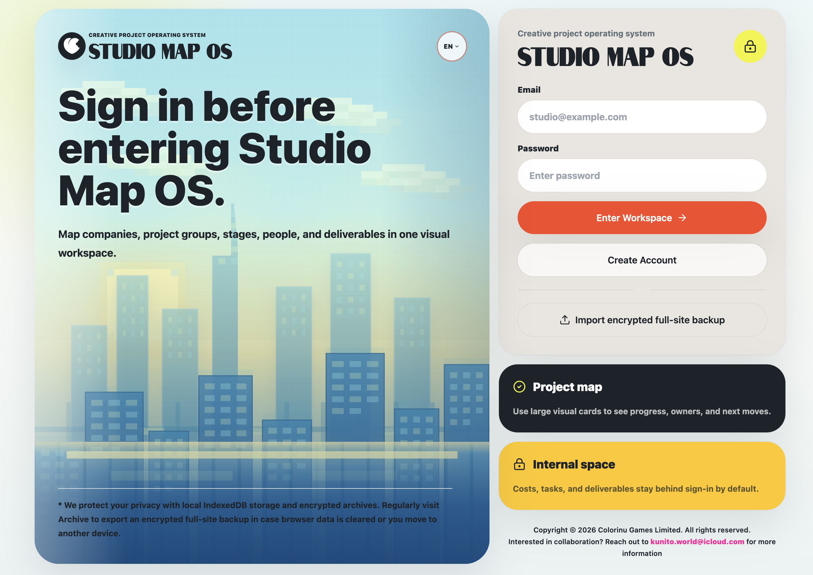
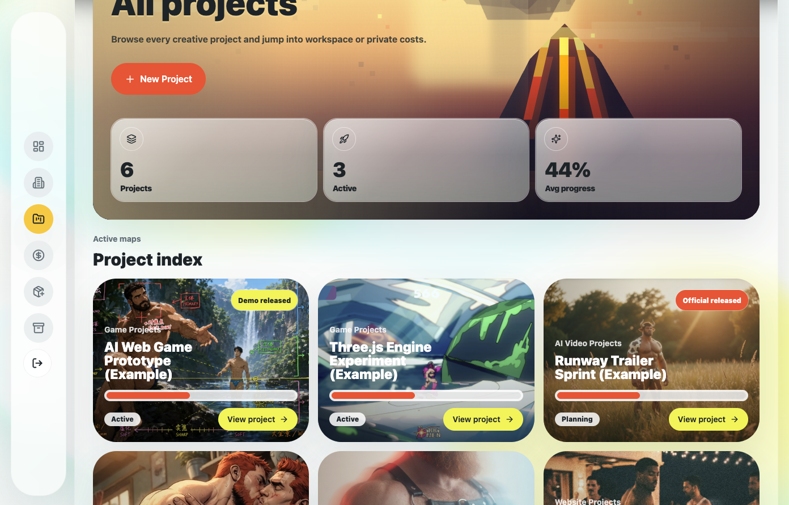
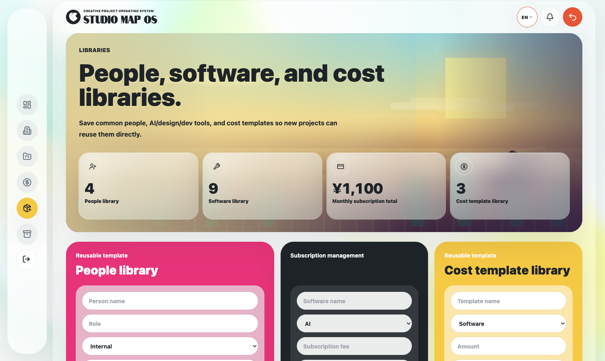

<p align="center">
  
</p>

<h1 align="center">Studio Map OS</h1>

<p align="center"><strong>BETRIEBSSYSTEM FÜR KREATIVE PROJEKTE</strong></p>

<p align="center">
  <a href="./README.md">English</a> · <a href="./README.zh-CN.md">简体中文</a> · <a href="./README.ja.md">日本語</a> · <a href="./README.es.md">Español</a> · <a href="./README.pt-BR.md">Português</a> · <strong>Deutsch</strong> · <a href="./README.fr.md">Français</a> · <a href="./README.ru.md">Русский</a> · <a href="./README.tr.md">Türkçe</a> · <a href="./README.ko.md">한국어</a> · <a href="./README.th.md">ไทย</a>
</p>

<p align="center">
  <strong>Damit ein Ein-Personen-Studio wie ein vollständiges Team arbeiten kann.</strong><br />
  Ein visuelles, Local-First-Betriebssystem für Projekte von unabhängigen Kreativen und Ein-Personen-Unternehmen.
</p>

<p align="center">
  <a href="https://kunito01.github.io/SMOS/login/"></a>
  <a href="https://github.com/kunito01/SMOS/releases/latest"></a>
</p>

<p align="center">
  <a href="https://github.com/kunito01/SMOS/stargazers"></a>
  <a href="https://github.com/kunito01/SMOS/forks"></a>
  <a href="https://github.com/kunito01/SMOS/issues"></a>
  
  
  
  
  
  <a href="./LICENSE"></a>
</p>

---

## Überblick

Studio Map OS verbindet Marken, Projektgruppen, Projekte, Personen, Software, Kosten, Zeitpläne, Veröffentlichungsmeilensteine und Archive in einem visuellen Arbeitsbereich. Es unterstützt unabhängige Kreative dabei, mehrere parallele Projekte zu steuern, ohne den kreativen Prozess auf eine generische Aufgabenliste zu reduzieren.

Die aktuelle Version ist eine installierbare Local-First-PWA. Geschäftsdaten verbleiben auf dem Gerät, werden mit Web Crypto verschlüsselt und in IndexedDB gespeichert. Web App Manifest, Service Worker, Offline-Fallback, Anwendungssymbole und der Workflow für die eigenständige Paketierung sind integriert. Konten, Wiederherstellungsschlüssel und Backups werden ebenfalls im Browser verwaltet; ein Remote-Backend für Geschäftsdaten und eine serverseitige Authentifizierung sind noch nicht angebunden.

## Screenshots







## Kernfunktionen

| Projektbetrieb | Lokale Datenkontrolle |
| --- | --- |
| Dashboard-Ansichten für das gesamte Studio, Marken und Projektgruppen | Lokale Konten und Wiederherstellungsschlüssel für Arbeitsbereiche |
| Projektstatus, Phasen, Aufgaben, Zeitpläne und Veröffentlichungen | Verschlüsselte Arbeitsbereichsdatensätze in IndexedDB |
| Phasenbudgets, Forderungen und Summen in mehreren Währungen | Verschlüsselte Geräte-, Arbeitsbereichs- und Projekt-Backups |
| Bibliotheken für Personen, Softwareabonnements und Kostenvorlagen | Migration älterer Browserdaten und transaktionale Wiederherstellung |
| Projektarchivierung, Wiederherstellung und endgültige Löschung | Feldgesteuerte, schreibgeschützte Freigabe-Snapshots |
| Layouts für Desktop, Tablet und schmale Mobilgeräte | Installierbare PWA, Offline-Fallback und elf Oberflächensprachen |

## Hauptmerkmale

- **Marken und Projektgruppen** — eigenständige Marken anlegen und Arbeit mit wiederverwendbaren Projektgruppentypen organisieren.
- **Projektarbeitsbereiche** — Status, Phasen, Ziele, Aufgaben, Personen, Werkzeuge, Materialien, Versionen und Aktivitätsprotokolle verfolgen.
- **Visuelle Zeitpläne** — Phasentermine, Aufgaben, Verantwortliche, Werkzeuge, Notizen und benutzerdefinierte Zeilen für jedes Projekt konfigurieren.
- **Strukturierte Budgets** — Personal, Reisen, tägliche Ausgaben, Outsourcing, Zusatzkosten und Software je Phase einschließlich Steuern und Risikoreserve planen.
- **Kosten und Forderungen** — Budgets, Ist-Kosten, Softwareabonnements und Zahlungspläne von Projekten zusammenführen.
- **Wiederverwendbare Bibliotheken** — Personen, Softwarewerkzeuge, Abonnements und Kostenvorlagen pflegen.
- **Archivierung und Portabilität** — Projekte archivieren, einzelne Projekte exportieren oder sämtliche Studio Map OS-Daten im Browser sichern.
- **Schreibgeschützte Freigabe** — auswählen, ob ein Projekt-Snapshot Zeitpläne, Liefergegenstände, Personen, Werkzeuge, Materialien, Versionen und Kostenvorschauen enthält.
- **Internationale Benutzeroberfläche** — Englisch, vereinfachtes Chinesisch, Japanisch, Spanisch, Portugiesisch, Deutsch, Französisch, Russisch, Türkisch, Koreanisch oder Thailändisch verwenden.

## Technologie

- Next.js 15 mit App Router
- React 19
- TypeScript
- Tailwind CSS
- Framer Motion
- Lucide Icons
- Serwist Service Worker
- Web Crypto API
- IndexedDB und Local Storage

## PWA-Unterstützung

Studio Map OS umfasst eine vollständige PWA-Integrationsstruktur:

- Ein Web App Manifest mit dem Anzeigemodus `standalone` und `/login` als Start-URL.
- Symbole in 192×192 und 512×512, maskierbare Symbole sowie Apple Touch Icons.
- Automatische Service-Worker-Registrierung und Laufzeit-Caching auf Basis von Serwist.
- Precaching für Stammseite, Anmeldung, Registrierung, Offline-Seite, Manifest, Marken-Asset und PWA-Symbole.
- Ein Fallback für Dokumentnavigation unter `/offline`.
- Metadaten für den iOS-Home-Bildschirm, Theme-Farben und `viewport-fit=cover`.
- Ein portables PWA-Paket mit dem eigenständigen Next.js-Server, statischen Assets und einem Startskript.

> [!NOTE]
> Im Entwicklungsmodus ist der Service Worker deaktiviert, damit veraltete Caches die Entwicklung nicht beeinträchtigen. Installation, Caching und Offline-Verhalten sollten mit einem Produktions-Build auf `localhost` oder über HTTPS geprüft werden.

## Erste Schritte

### Voraussetzungen

- Node.js 20 LTS empfohlen
- npm
- Ein moderner Browser mit Unterstützung für Web Crypto und IndexedDB

### Installieren und ausführen

```bash
git clone https://github.com/kunito01/SMOS.git
cd SMOS
npm install
npm run dev
```

Öffnen Sie [http://localhost:3000/register](http://localhost:3000/register), um das erste lokale Konto zu erstellen.

Bei der ersten Verwendung:

1. Geben Sie einen Namen, eine E-Mail-Adresse und ein Passwort mit mindestens acht Zeichen ein.
2. Erstellen Sie einen neuen Arbeitsbereich.
3. Kopieren Sie den generierten 16-stelligen Wiederherstellungsschlüssel für den Arbeitsbereich sofort oder laden Sie ihn herunter.
4. Bestätigen Sie vor dem Betreten des Arbeitsbereichs, dass der Wiederherstellungsschlüssel sicher verwahrt wurde.

> [!IMPORTANT]
> Der Wiederherstellungsschlüssel wird nicht im Klartext zusammen mit dem Konto gespeichert. Wenn sowohl das Passwort als auch der Wiederherstellungsschlüssel verloren gehen und kein verwendbares Backup mehr vorhanden ist, können die Daten des Arbeitsbereichs möglicherweise nicht wiederhergestellt werden.

Bestehende lokale Konten können sich unter [http://localhost:3000/login](http://localhost:3000/login) anmelden. Es gibt kein vorkonfiguriertes Konto, das ein beliebiges Passwort akzeptiert.

### Produktionsmodus und PWA-Prüfung

```bash
npm run build
npm run start
```

Öffnen Sie [http://localhost:3000/login](http://localhost:3000/login) in einem PWA-fähigen Browser, um Manifest, Service Worker und Installationseinstieg zu prüfen. Browser behandeln `localhost` als sicheren Kontext; Produktionsbereitstellungen sollten HTTPS verwenden.

### Portables PWA-Paket erstellen

```bash
npm run package:pwa
```

Das Paket wird nach `output/pwa/studio-map-os-pwa/` geschrieben. Es enthält den eigenständigen Server, PWA-Assets und den macOS-Starter `START_STUDIO_MAP_OS.command`, der standardmäßig `127.0.0.1:3002` verwendet.

## Hauptrouten

| Route | Zweck |
| --- | --- |
| `/register` | Ein lokales Konto und einen Arbeitsbereich erstellen oder einem Arbeitsbereich mit einem verschlüsselten Backup beitreten |
| `/login` | Ein lokales Konto entsperren oder ein vollständiges Geräte-Backup wiederherstellen |
| `/offline` | Dokument-Fallback, wenn die Service-Worker-Navigation fehlschlägt |
| `/dashboard` | Studioübersicht, Ansichtsbereiche, Kennzahlen und Projektkarten |
| `/companies` | Marken- und Projektgruppenverwaltung |
| `/company/?companyId=...` | Markendetails und verknüpfte Projektzusammenfassungen |
| `/projects` | Alle aktiven Projekte |
| `/project/?projectId=...` | Projektstatus, Zeitplan, Veröffentlichungen, Forderungen und Einstellungen |
| `/project-costs/?projectId=...` | Projektbudget und Kostendetails |
| `/project-share/?projectId=...` | Einstellungen für schreibgeschützte Freigabefelder |
| `/costs` | Studioübergreifende Kostensummen und Einstellungen der Anzeigewährung |
| `/libraries` | Bibliotheken für Personen, Softwareabonnements und Kostenvorlagen |
| `/archive` | Archivierte Projekte sowie Wiederherstellung von Geräte- und Arbeitsbereichs-Backups |
| `/share/?token=...` | Lokaler schreibgeschützter Projekt-Snapshot |

## Daten- und Sicherheitsmodell

```text
React-Seiten
    ↓
Lokale Adapter in lib/api
    ↓
Geschäftsdatenbank im Arbeitsspeicher
    ↓
Web-Crypto-Verschlüsselung
    ↓
IndexedDB-Persistenz
```

- Geschäftsdaten werden nach Arbeitsbereich isoliert und als verschlüsselte IndexedDB-Datensätze gespeichert.
- Ein Passwort entsperrt den geschützten Master-Schlüssel des Arbeitsbereichs; der Master-Schlüssel wird nach der Anmeldung ausschließlich im Arbeitsspeicher verwendet.
- Mit dem 16-stelligen Wiederherstellungsschlüssel kann der Master-Schlüssel des Arbeitsbereichs wiederhergestellt und können verschlüsselte Backup-Dateien entsperrt werden.
- Arbeitsbereichsdatensätze und Backup-Umschläge verwenden Browser-Kryptografie, darunter PBKDF2, HKDF und AES-GCM.
- Ein vollständiges Geräte-Backup enthält lokale Konten, Arbeitsbereiche, Einstellungen und verschlüsselte Datenbank-Snapshots. Arbeitsbereichs- und Projektexporte sind ebenfalls verschlüsselt.
- Browser können Anfragen auf dauerhaften Speicher ablehnen; verschlüsselte Backups bleiben daher ein wesentlicher Bestandteil des Datenschutzes.

> [!WARNING]
> Diese Mechanismen wurden keiner unabhängigen Sicherheitsprüfung unterzogen. Sie ersetzen weder professionelles Schlüsselmanagement noch Server-Backups oder Identitätssysteme für Unternehmen.

## Kosten in mehreren Währungen

Die derzeit unterstützten Berechnungs- und Anzeigewährungen sind:

- CNY — Chinesischer Yuan
- USD — US-Dollar
- JPY — Japanischer Yen
- EUR — Euro

Der Browser ruft Referenzkurse direkt vom EZB-gestützten Dienst von Frankfurter ab und greift bei einem Fehlschlag auf den Browser-Cache oder integrierte Kurse zurück. Die Wechselkurse sind für interne Studioschätzungen vorgesehen, nicht für Abrechnungen oder Finanzberatung.

## Backup-Dateien

| Typ | Inhalt | Typischer Dateiname |
| --- | --- | --- |
| Vollständiges Geräte-Backup | Alle lokalen Konten, Arbeitsbereiche, Einstellungen und verschlüsselten Daten | `studio-map-os-*.smos-backup.json` |
| Arbeitsbereichs-Backup | Geschäftsdaten und Einstellungen des aktuellen Arbeitsbereichs | `studio-map-os-workspace-*.smos-backup.json` |
| Projektdatei | Snapshot eines Projekts | `studio-map-os-project-*.smos-project.json` |

Prüfen Sie vor der Wiederherstellung den Backup-Typ und den Wiederherstellungsschlüssel. Eine vollständige Gerätewiederherstellung kann vorhandene Studio Map OS-Daten im aktuellen Browser ersetzen.

## Aktuelle Grenzen öffentlicher Freigaben

Schreibgeschützte Freigabedatensätze verbleiben derzeit im Browser und im Website-Origin, in dem sie erzeugt wurden. Eine Freigabe-URL kann lokal geöffnet werden, die Daten werden jedoch nicht automatisch auf einem entfernten Server veröffentlicht. Daraus folgt:

- Ein Link funktioniert möglicherweise in einem anderen Browser, nach dem Löschen der Website-Daten oder auf einem anderen Gerät nicht mehr.
- Diese Funktion entspricht noch nicht einer im Internet gehosteten öffentlichen Seite.
- Geräteübergreifende Freigaben erfordern entfernten Speicher sowie Infrastruktur für Zugriffskontrolle und Widerruf.

## Internationalisierung

Die Benutzeroberfläche unterstützt elf Sprachen. Wenn ein spezifischer Schlüssel fehlt, greifen Locale-Dateien auf Englisch zurück; die russischen und türkischen Wörterbücher decken derzeit sämtliche Übersetzungsschlüssel ab. Verbesserungen der Übersetzungsabdeckung und Formulierungen sind über Issues und Pull Requests willkommen.

## Projektstruktur

```text
app/                  Next.js-Routen, Manifest, Service Worker und statische PWA-Einstiegspunkte
components/           Seiten, Produktmodule, Layout und gemeinsame UI
lib/api/              Lokale Adapter für die Geschäfts-API
lib/i18n/             Oberflächenwörterbücher und Domänenbezeichnungen
lib/mock/             Demo-Ausgangsdaten und Aggregationslogik
lib/security/         Verschlüsselung für Arbeitsbereiche und öffentliche Freigaben
lib/storage/          IndexedDB und Unterstützung für dauerhaften Speicher
lib/types/            Domänenmodelle
lib/utils/            Dienstprogramme für Budget, Währung, Phasen und Veröffentlichungen
public/               Marken-Assets, PWA-Symbole und generierte Worker-Pakete
scripts/              Build- und Paketierungsskripte für die portable PWA
```

## Qualitätsprüfungen

```bash
npm run lint
npx tsc --noEmit --incremental false
```

Das Repository enthält noch keine automatisierten Unit- oder End-to-End-Tests. Änderungen an Verschlüsselung, Migration, Wiederherstellung oder Budgetberechnungen sollten vor dem Zusammenführen zusätzlich geprüft werden.

## Aktuelle Einschränkungen

- Geschäfts-APIs sind weiterhin browserlokale Adapter; es ist kein produktives Server-Backend angebunden.
- Neue Projekte übernehmen Teile der Demo-Projektstruktur, anstatt mit einer vollständig leeren Vorlage zu beginnen.
- Bearbeitungsabläufe für Ist-Kosten, Materialien und Aktivitätsprotokolle sind noch nicht vollständig verfügbar.
- Details zu Projektgruppen, Widerruf von Freigaben und Steuerelemente für den Linkablauf müssen noch angebunden werden.
- Nach einem vollständigen Neuladen der Seite muss der Arbeitsbereich erneut mit dem Passwort entsperrt werden.
- Die PWA-Unterstützung ist integriert, automatisierte Lighthouse-, Installationsablauf- und Offline-End-to-End-Tests sind jedoch noch nicht konfiguriert.
- Nicht zwischengespeicherte dynamische Seiten und aktive Netzwerkendpunkte können offline weiterhin nicht verfügbar sein; Offline-Fallback und lokale Daten ersetzen keine entfernten APIs.

## Mitwirken

Issues und Pull Requests sind willkommen. Vor dem Einreichen einer Änderung:

1. Beschreiben Sie die betroffene Seite, das Datenmodell oder den Migrationsumfang.
2. Prüfen Sie sowohl Desktop-Layouts als auch Layouts für schmale Bildschirme.
3. Führen Sie ESLint und die TypeScript-Prüfung aus.
4. Dokumentieren Sie bei Änderungen am Datenformat die Abwärtskompatibilität und die Backup-Wiederherstellung.

## Lizenz

Dieses Projekt steht unter der Apache License 2.0. Einzelheiten finden Sie in der [LICENSE](./LICENSE). Die Lizenz gestattet die Nutzung, Vervielfältigung, Änderung und Verbreitung gemäß ihren Bedingungen.

<p align="center">
  <strong>Studio Map OS</strong><br />
  Copyright © 2026 Colorinu Games Limited. Alle Rechte vorbehalten.<br />
  <a href="mailto:kunito.world@icloud.com">kunito.world@icloud.com</a>
</p>
