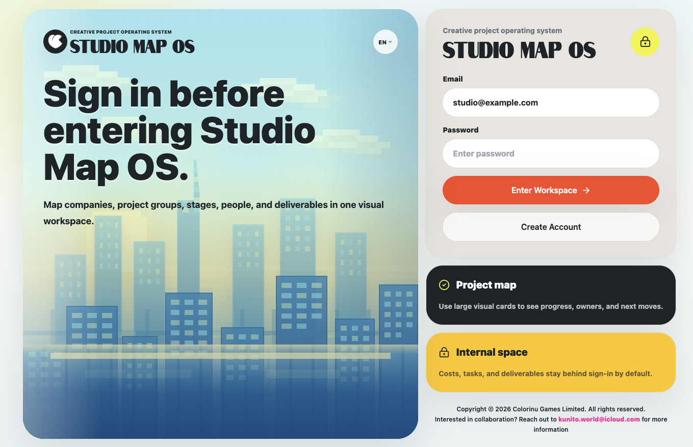
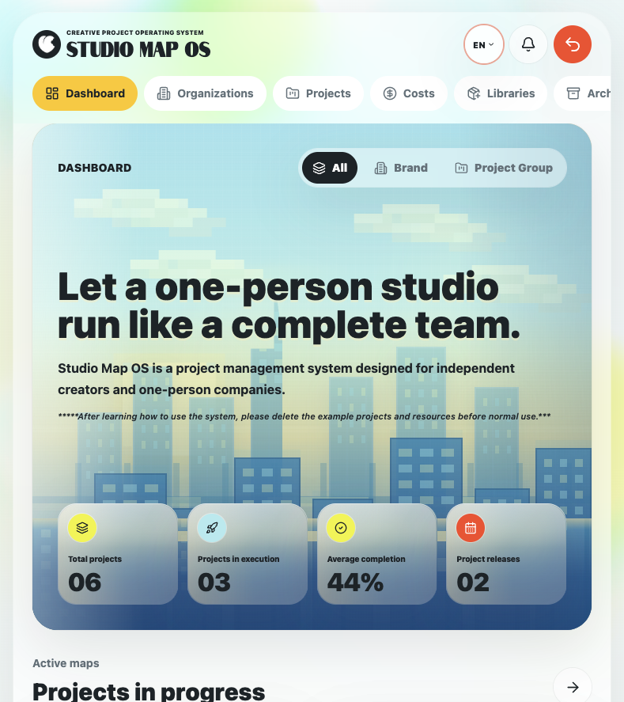
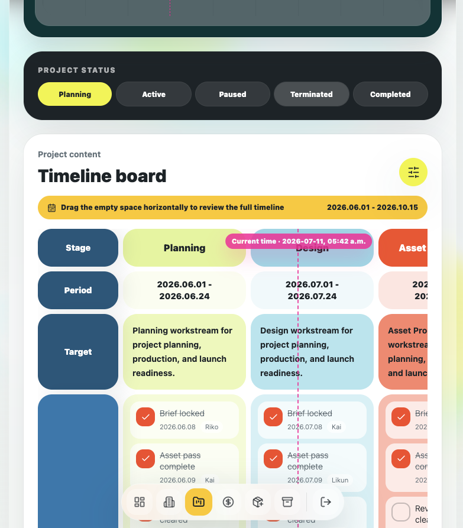

<p align="center">
  
</p>

<h1 align="center">Studio Map OS</h1>

<p align="center"><strong>CREATIVE PROJECT OPERATING SYSTEM</strong></p>

---

<p align="center">
  <strong>English</strong> · 中文 · 日本語 · Español · Português · Deutsch · Français · 한국어 · ไทย
</p>

<p align="center">
  <strong>Let a one-person studio run like a complete team.</strong><br />
  A local-first visual project operating system for independent creators and one-person companies.
</p>

<p align="center">
  <em>Map brands, project groups, projects, people, tools, costs, releases, and archives in one rounded visual workspace.</em>
</p>

<p align="center">
  <a href="https://github.com/kunito01/SMOS/stargazers"></a>
  <a href="https://github.com/kunito01/SMOS/forks"></a>
  <a href="https://github.com/kunito01/SMOS/issues"></a>
  
</p>

<p align="center">
  
  
  
  
  
  
</p>

<br />

## Overview

Studio Map OS brings the operating structure of a full creative team into a workspace designed for one person. Brands, project groups, active work, people, software, costs, timelines, releases, archives, and reusable templates stay connected without flattening the work into a generic task list.

The current version is a browser-based product demo with local persistence. It is designed as a clear frontend and data-model foundation for a future authenticated backend.

## Highlights

| Visual project operations | Local data control |
| --- | --- |
| Dashboard scopes for all work, one brand, or one project group | Full-site JSON backup and restore |
| Project status, timeline, deliverables, releases, and archive flow | Individual project save and load files |
| Reusable people, software, and cost-template libraries | Browser-local persistence for demo data |
| Currency-aware cost totals with exchange-rate conversion | Public read-only share settings with private data controls |
| Responsive desktop, tablet, and narrow mobile layouts | Nine complete interface languages |

## Screenshots

### 01 · Sign in

<p align="center">
  
</p>

### 02 · Project index

<p align="center">
  
</p>

### 03 · People, software, and cost libraries

<p align="center">
  
</p>

### 04 · Studio dashboard

<p align="center">
  
</p>

### 05 · Project timeline board

<p align="center">
  
</p>

## Core capabilities

- **Brands and project groups** — organize different lines of work without tying project-group types to a single brand.
- **Project workspaces** — track status, stages, targets, tasks, people, tools, deliverables, materials, versions, and release nodes.
- **Visual timeline** — drag horizontally through project stages while the label column stays visible.
- **Cost operations** — combine personnel, software, outsourcing, asset, and server costs across supported currencies.
- **Libraries** — save reusable people, subscriptions, software tools, and cost templates for new projects.
- **Archive and portability** — archive projects without deleting them, export individual projects, or move the whole workspace between computers with a JSON backup.
- **Public sharing** — generate controlled read-only project pages while keeping private contact and cost data hidden by default.
- **International interface** — complete English, Chinese, Japanese, Spanish, Portuguese, German, French, Korean, and Thai dictionaries.

## Local setup

```bash
git clone https://github.com/kunito01/SMOS.git
cd SMOS
npm install
npm run dev
```

Open [http://localhost:3000/login](http://localhost:3000/login). The demo account is prefilled as `studio@example.com`; enter any password to open the workspace.

## Quality checks

```bash
npm run lint
npx tsc --noEmit
```

## Main routes

| Route | Purpose |
| --- | --- |
| `/dashboard` | Studio overview, scopes, project metrics, and active maps |
| `/companies` | Brands and project-group management |
| `/projects` | Complete visual project index |
| `/projects/[projectId]` | Project status, timeline, releases, content, and settings |
| `/costs` | Portfolio-level cost view and final display currency |
| `/libraries` | People, software, subscriptions, and reusable cost templates |
| `/archive` | Archived projects plus full-site backup and restore |

## Architecture notes

- Built with Next.js 15, React 19, TypeScript, Tailwind CSS, Framer Motion, and Lucide icons.
- Mock API adapters live in `lib/api/`; demo seed data lives in `lib/mock/`.
- Browser persistence and backup parsing are centralized in `lib/api/mock-persistence.ts`.
- The exchange-rate endpoint uses a live reference source when available and falls back safely when offline.
- Private project costs remain separated from public read-only share pages.

---

<p align="center">
  <strong>Studio Map OS</strong><br />
  Copyright © 2026 Colorinu Games Limited. All rights reserved.<br />
  <a href="mailto:kunito.world@icloud.com">kunito.world@icloud.com</a>
</p>
